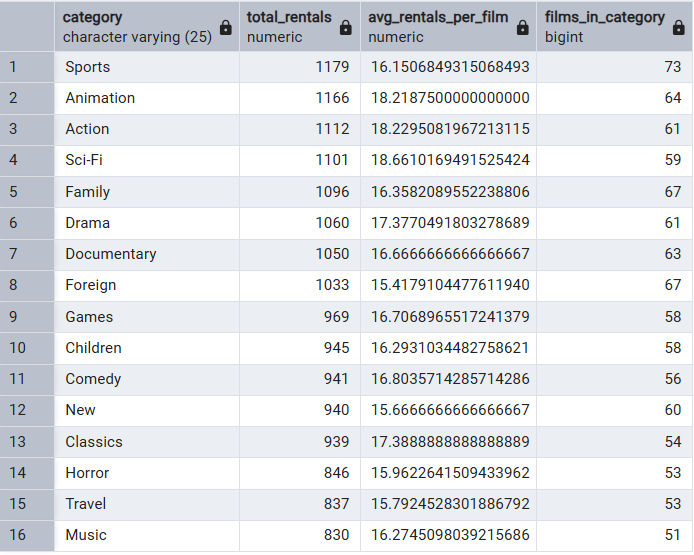
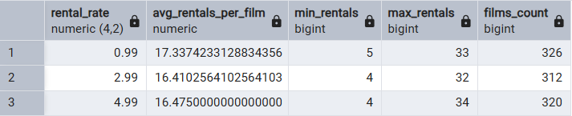
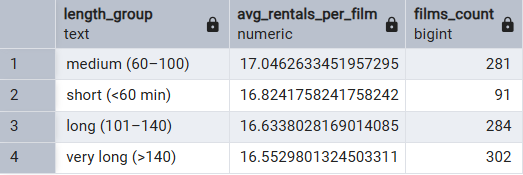
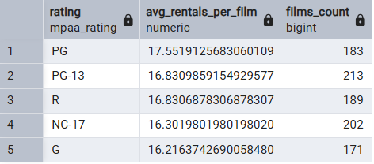
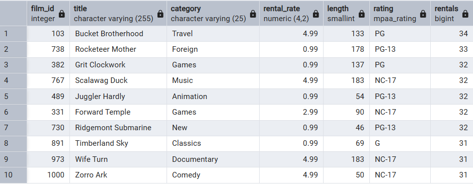

# Analiza wypożyczeń filmów w PostgreSQL

Ten projekt to podstwowa analiza danych w sql z postgresql, z wykorzystaniem przykładowej bazy **dvdrental**.
Projekt jest na tyle podstawowy, że nie rozwodziłem się nad metodyką w readme. Całość jest w pliku **rental_analysis.sql**. Bardziej skupiłem się na wnioskach płynących z uzyskanych wykresów którę znajdują się niżej

Celem jest sprawdzenie, **co wpływa na to, jak często film jest wypożyczany**:
- kategoria filmu (komedia, dramat itd.),
- cena wypożyczenia (`rental_rate`),
- długość filmu (`length`),
- rating (`G`, `PG`, `R`…).

---

## Struktura projektu

```
.
├─ rental_analysis.sql           #skrypt sql
├─ dvdrental.tar                 #dane
├─ images/
│  ├─ cena_vs_wypozyczenia.png
│  ├─ dlugosc_vs_wypozyczenia.png
│  ├─ kategoria.png
│  ├─ wiek_vs_wypozczenia.png
│  └─ najlepsze_tytuły.png
└─ README.md
```
---


### A. Popularność kategorii



---

### B. Cena a częstotliwość wypożyczeń




---

### C. Długość filmu a wypożyczenia




---

### D. Rating (grupa wiekowa) a wypożyczenia




---

### E. Najchętniej wypożyczane filmy (top10)



---

## Najważniejsze wnioski

- **Kategorie:**  
  - Kategoria sport generuje najwięcej wypożyczeń. Nieciężko równierz zauważyć, że ma najwięcej tytułów co znacząco na to wpływa.
  - Wiarygodniejszą wartością jest (`avg_rentals-per_film`) która jasno wskazuję dominację kategorii takich jak: Sports, Action czy Sci-Fi.
  - Warto również wspomnieć o kategorii Classics, która nie wyróżnia się liczbą wypożyczeń, jednakże gdy weźmiemy pod uwagę zarówno jej (`avg_rentals-per_film`) jak i liczbę filmów, jest to coś wartego uwagi.

- **Cena (`rental_rate`):**  
  Filmy w cenie "0.99" cieszą się większym powodzeniem, niż ich droższe odpowiedniki. Wskazuję   na to ich jasna przewaga w (`avg_rentals-per_film`). Jednogłośnie można stwierdzić, że niska cena nie odpycha klientów, a nawet bardzo możliwe, że nawet ich przyciąga. Może to być spowodowane np. brakiem zdecydowania i poprostu wybieranie tańszej opcji.

- **Długość filmu:**  
  - Najczęściej wypożyczane są filmy o średniej długości (60–100 minut).  
  - Filmy bardzo krótkie / bardzo długie mają mniejszą średnią liczby wypożyczeń.
  - Warto zwrócić uwagę na ogromną różnicę w ilości filmów krótkich w stosunku do reszty. Mimo to nie odbiegają one od reszty średnią liczbą wypożyczeń na tytuł.

- **Rating:**  
  - Filmy o ratingu `PG` mają najwyższą średnią liczbę wypożyczeń, co może sugerować, że tytuły „rodzinne” są popularniejsze.
  - Możemy zauwarzyć spadek (`avg_rentals-per_film`) wraz z zaostrzaniem ograniczeń wiekowych. Powodem, może być nie tyle mniejsze zainteresowanie, co poprostu profil/wiek klientów.

---
