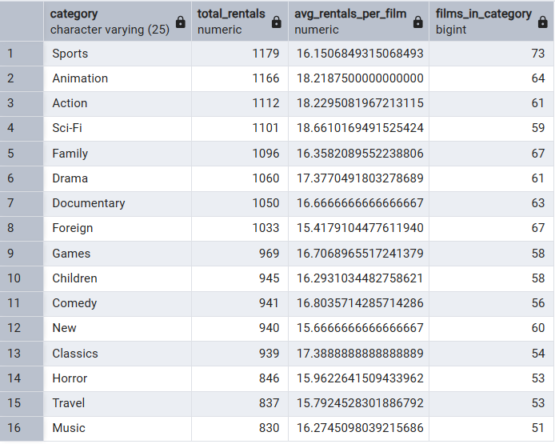
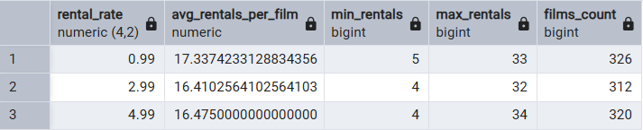
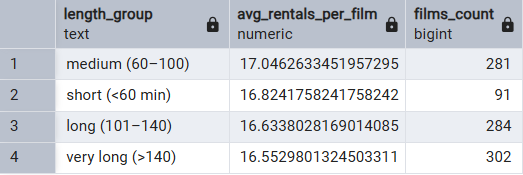
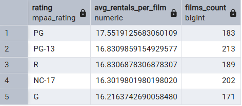
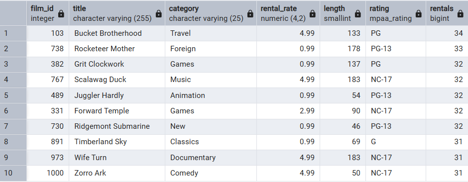

*[🇵🇱 Przejdź do polskiej wersji (Go to Polish version)](#wersja-polska)*

---

# Movie Rental Analysis in PostgreSQL

This project is a basic data analysis in SQL with PostgreSQL, using the sample **dvdrental** database.
The project is basic enough that I didn't dwell on the methodology in the readme. Everything is in the **rental_analysis.sql** file. I focused more on the conclusions drawn from the obtained charts, which are located below.

---
The goal of the project is to check **what affects how often a movie is rented**:
- movie category (comedy, drama, etc.),
- rental price (`rental_rate`),
- movie length (`length`),
- rating (`G`, `PG`, `R`...).

---

## Project Structure

```text
.
├─ rental_analysis.sql           # SQL script
├─ dvdrental.tar                 # data
├─ images/
│  ├─ cena_vs_wypozyczenia.png
│  ├─ dlugosc_vs_wypozyczenia.png
│  ├─ kategoria.png
│  ├─ wiek_vs_wypozczenia.png
│  └─ najlepsze_tytuły.png
└─ README.md
```
---

### A. Category Popularity



---

### B. Price vs. Rental Frequency




---

### C. Movie Length vs. Rentals




---

### D. Rating (Age Group) vs. Rentals




---

### E. Most Rented Movies (Top 10)



---

## Key Conclusions

- **Categories:** - The Sports category generates the most rentals. It is also easy to notice that it has the most titles, which significantly affects this.
  - A more reliable value is (`avg_rentals-per_film`), which clearly indicates the dominance of categories such as Sports, Action, or Sci-Fi.
  - It is also worth mentioning the Classics category, which does not stand out in the number of rentals, however, when we consider both its (`avg_rentals-per_film`) and the number of movies, it is something noteworthy.

- **Price (`rental_rate`):** Movies priced at "0.99" are more popular than their more expensive counterparts. This is indicated by their clear advantage in (`avg_rentals-per_film`). It can be unanimously stated that a low price does not repel customers, and it is very possible that it even attracts them. This could be due to, for example, indecisiveness and simply choosing the cheaper option.

- **Movie length:** - Medium-length movies (60–100 minutes) are rented most often.  
  - Very short / very long movies have a lower average number of rentals.
  - It is worth noting the huge difference in the number of short movies compared to the rest. Despite this, they do not deviate from the rest in the average number of rentals per title.

- **Rating:** - Movies with a `PG` rating have the highest average number of rentals, which may suggest that "family" titles are more popular.
  - We can notice a decrease in (`avg_rentals-per_film`) as age restrictions become stricter. The reason may not be so much lower interest, but simply the profile/age of the customers.

---

<br>

*[🇬🇧 Go to English version](#movie-rental-analysis-in-postgresql)*

---

## Wersja polska

# Analiza wypożyczeń filmów w PostgreSQL

Ten projekt to podstwowa analiza danych w sql z postgresql, z wykorzystaniem przykładowej bazy **dvdrental**.
Projekt jest na tyle podstawowy, że nie rozwodziłem się nad metodyką w readme. Całość jest w pliku **rental_analysis.sql**. Bardziej skupiłem się na wnioskach płynących z uzyskanych wykresów którę znajdują się niżej

---
Celem projektu jest sprawdzenie, **co wpływa na to, jak często film jest wypożyczany**:
- kategoria filmu (komedia, dramat itd.),
- cena wypożyczenia (`rental_rate`),
- długość filmu (`length`),
- rating (`G`, `PG`, `R`…).

---

## Struktura projektu

```text
.
├─ rental_analysis.sql           #skrypt sql
├─ dvdrental.tar                 #dane
├─ images/
│  ├─ cena_vs_wypozyczenia.png
│  ├─ dlugosc_vs_wypozyczenia.png
│  ├─ kategoria.png
│  ├─ wiek_vs_wypozczenia.png
│  └─ najlepsze_tytuły.png
└─ README.md
```
---


### A. Popularność kategorii


---

### B. Cena a częstotliwość wypożyczeń


---

### C. Długość filmu a wypożyczenia


---

### D. Rating (grupa wiekowa) a wypożyczenia


---

### E. Najchętniej wypożyczane filmy (top10)


---

## Najważniejsze wnioski

- **Kategorie:** - Kategoria sport generuje najwięcej wypożyczeń. Nieciężko równierz zauważyć, że ma najwięcej tytułów co znacząco na to wpływa.
  - Wiarygodniejszą wartością jest (`avg_rentals-per_film`) która jasno wskazuję dominację kategorii takich jak: Sports, Action czy Sci-Fi.
  - Warto również wspomnieć o kategorii Classics, która nie wyróżnia się liczbą wypożyczeń, jednakże gdy weźmiemy pod uwagę zarówno jej (`avg_rentals-per_film`) jak i liczbę filmów, jest to coś wartego uwagi.

- **Cena (`rental_rate`):** Filmy w cenie "0.99" cieszą się większym powodzeniem, niż ich droższe odpowiedniki. Wskazuję  na to ich jasna przewaga w (`avg_rentals-per_film`). Jednogłośnie można stwierdzić, że niska cena nie odpycha klientów, a nawet bardzo możliwe, że nawet ich przyciąga. Może to być spowodowane np. brakiem zdecydowania i poprostu wybieranie tańszej opcji.

- **Długość filmu:** - Najczęściej wypożyczane są filmy o średniej długości (60–100 minut).  
  - Filmy bardzo krótkie / bardzo długie mają mniejszą średnią liczby wypożyczeń.
  - Warto zwrócić uwagę na ogromną różnicę w ilości filmów krótkich w stosunku do reszty. Mimo to nie odbiegają one od reszty średnią liczbą wypożyczeń na tytuł.

- **Rating:** - Filmy o ratingu `PG` mają najwyższą średnią liczbę wypożyczeń, co może sugerować, że tytuły „rodzinne” są popularniejsze.
  - Możemy zauwarzyć spadek (`avg_rentals-per_film`) wraz z zaostrzaniem ograniczeń wiekowych. Powodem, może być nie tyle mniejsze zainteresowanie, co poprostu profil/wiek klientów.

---
